# **🎒 Algorithm Design Projects | پروژه‌های طراحی الگوریتم**

**A university project in which the following problems are solved in Java language and also have a graphical appearance using JavaFX.**

**یک پروژه دانشگاهی که در آن مسائل زیر با زبان جاوا حل می‌شود و همچنین دارای ظاهر گرافیکی با استفاده از JavaFX هستند.**

* **Fractional Knapsack Problem**
* **Task Scheduling Problem**
* **Job Sequencing Problem with Deadlines**
* **Knapsack Problem Backtrack**
* **Subset Sum Problem Backtracking**

# 💬 **نکات پروژه**

* عکس‌های برنامه در دایرکتوری ScreenShots قرار دارند.
* برای اجرا برنامه، به Java JDK 16 یا بیشتر نیاز دارید.
* برای دسترسی به همه‌ی پروژه‌های دانشگاهی من، به این لینک مراجعه کنید:

👈🏻 **[پروژه‌های دانشگاهی من](https://github.com/bestmahdi2/Uni__Bachelors_SKU_Path)**

# 📝 **توضیحات پروژه**
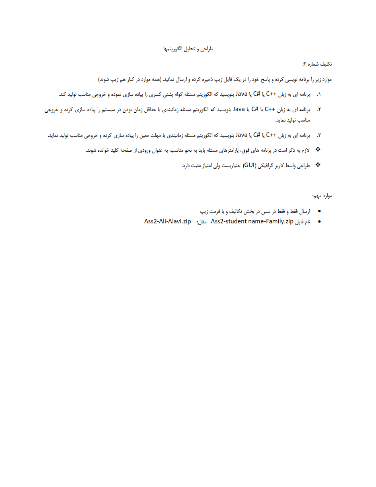

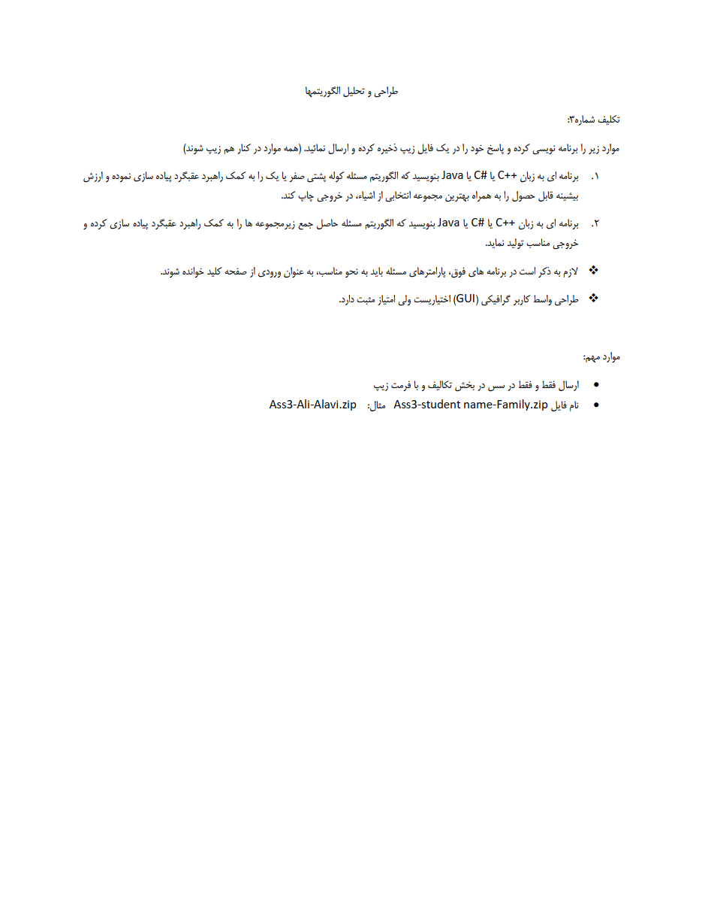

# 🖼 **عکس‌های پروژه**

  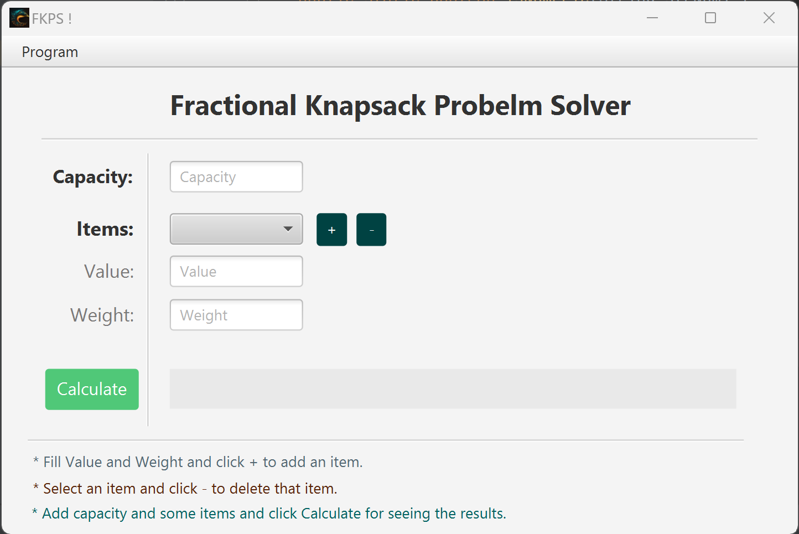
  
  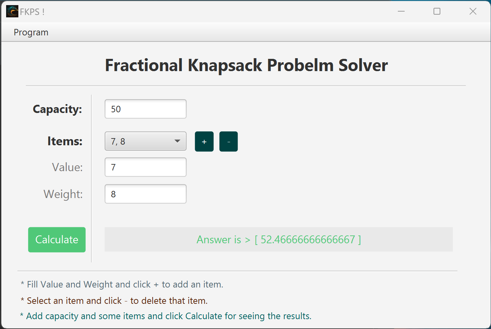
  
  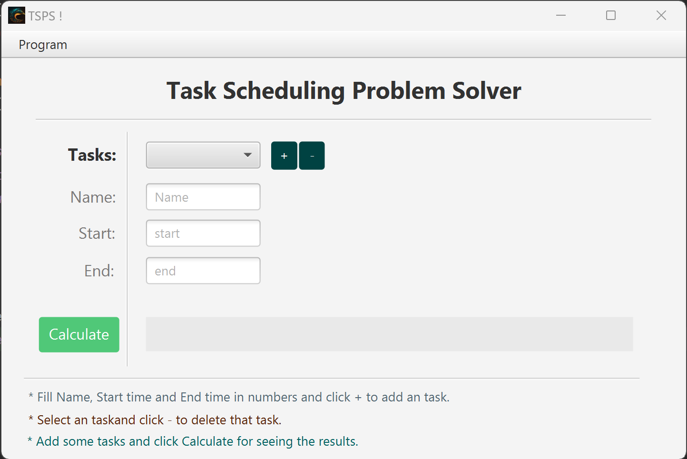
  
  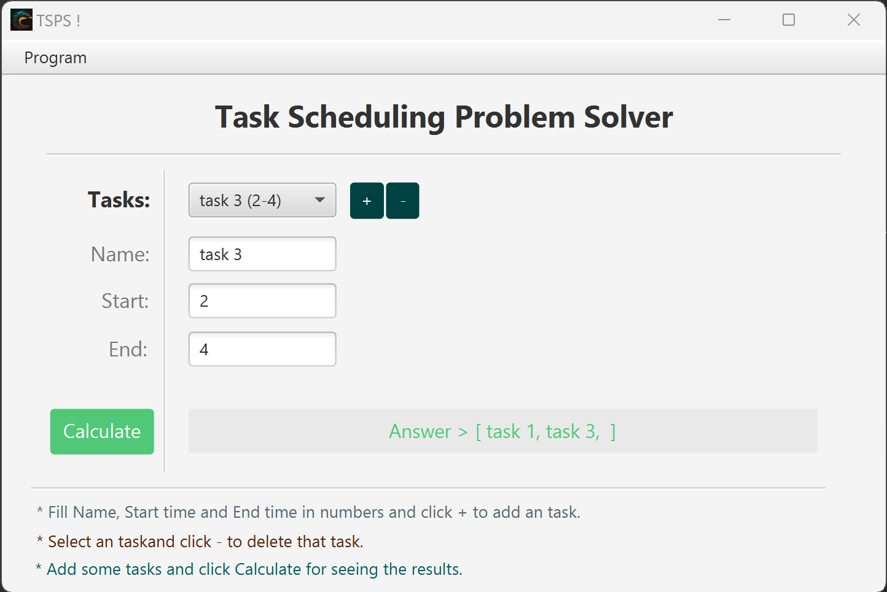
  
  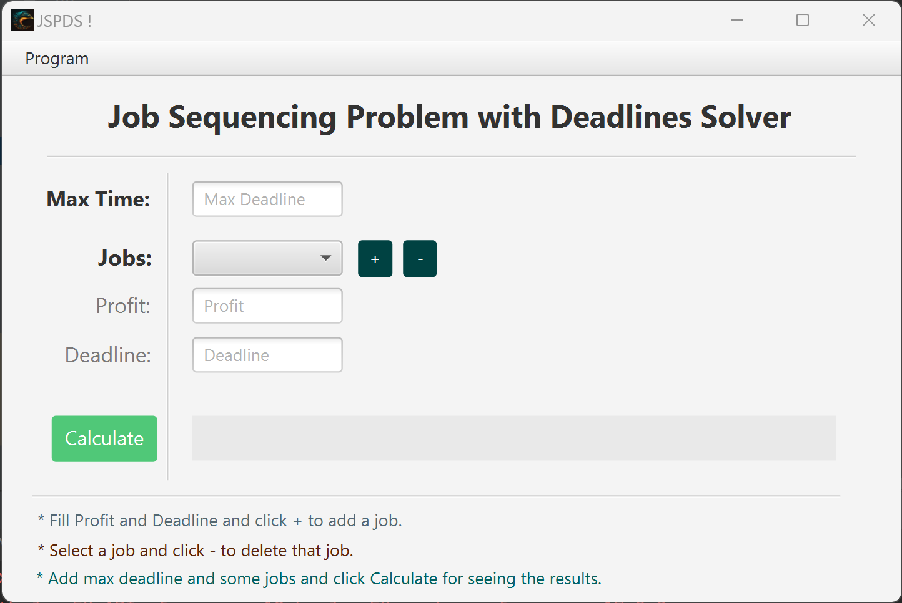
  
  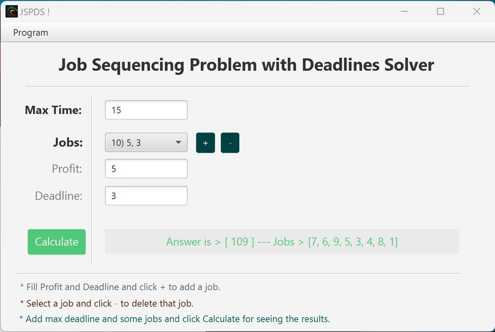
  
  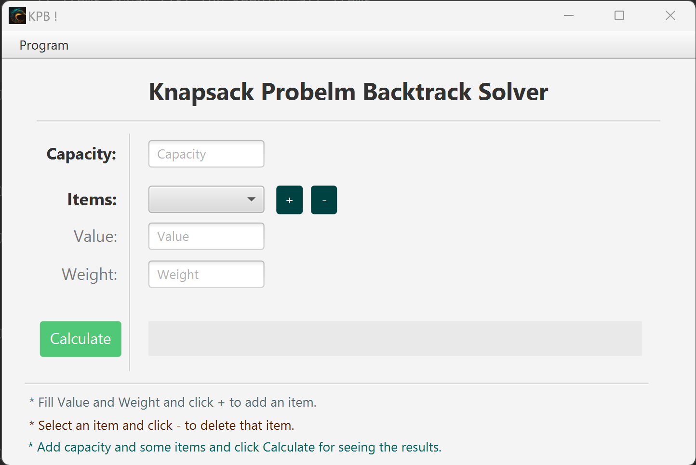
  
  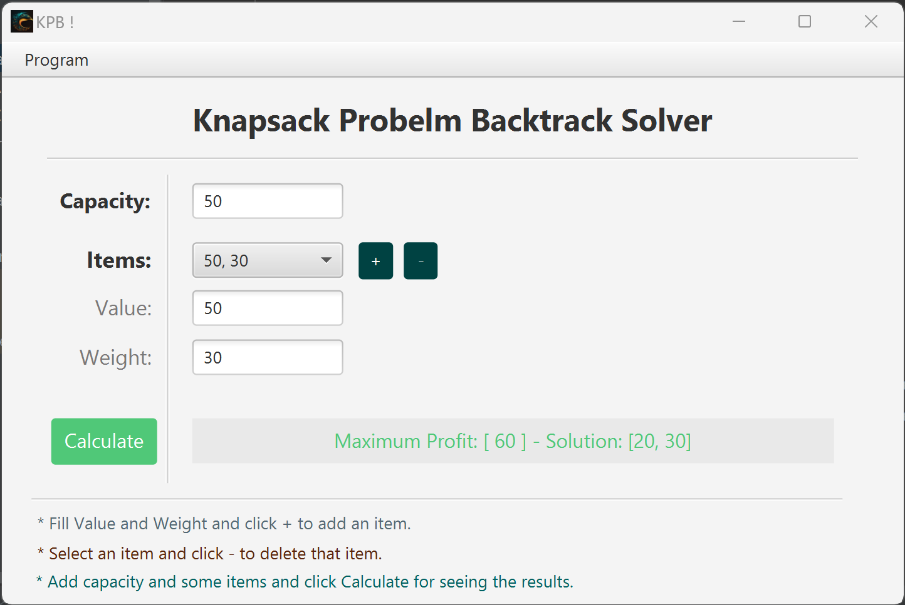
  
  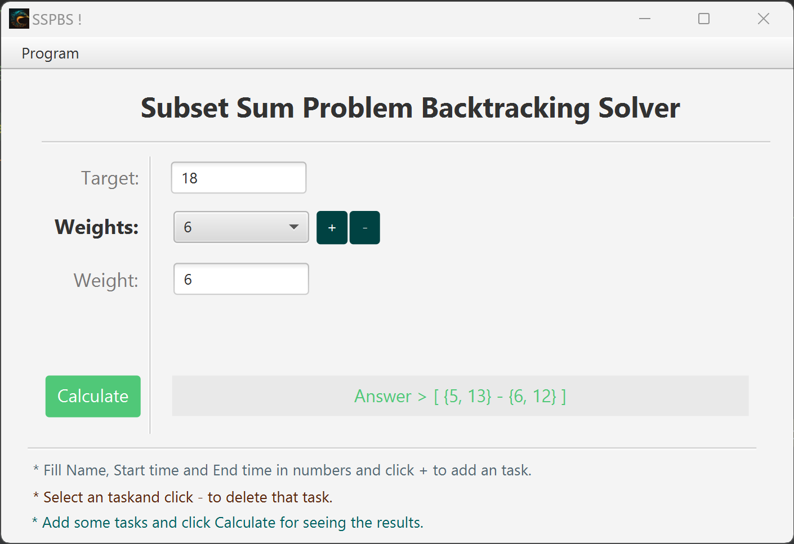
  
  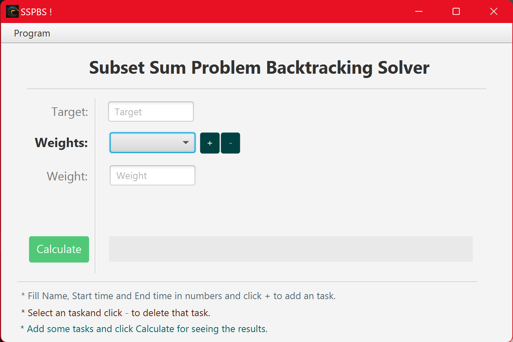

